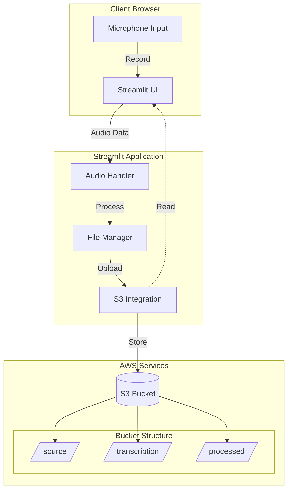
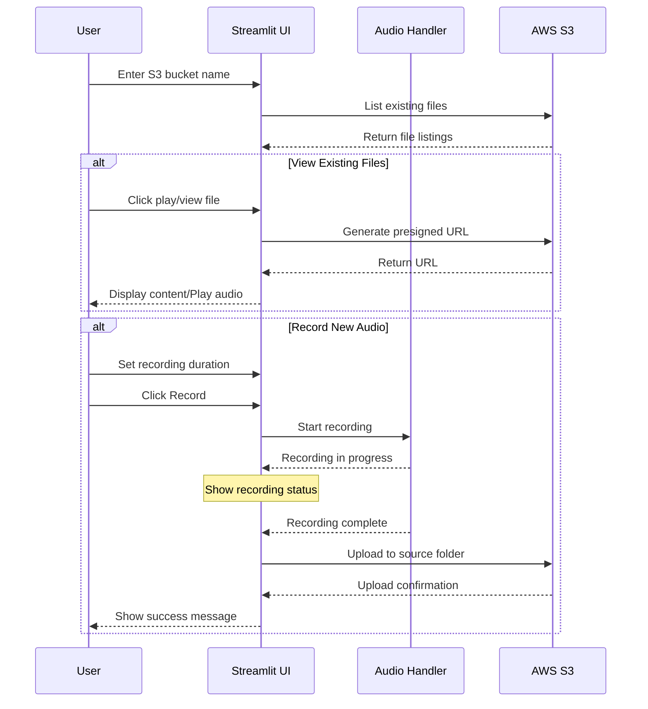
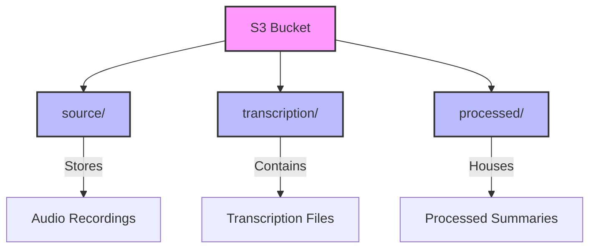

# Audio Summarizer Dashboard

A Streamlit application that allows users to record audio, manage recordings, and view their transcriptions and summaries. This application integrates with AWS S3 for storage and provides a user-friendly interface for audio management.

To setup the backend, clone the following repo and follow the instructions: https://github.com/aws-samples/amazon-bedrock-audio-summarizer

## Architecture



## Application Flow



## S3 Bucket Structure



## Prerequisites

### System Requirements
- Python 3.8+
- pip package manager
- Operating system: Windows/macOS/Linux
- Microphone access

### AWS Requirements
- AWS account
- S3 bucket with following structure:
  ```
  your-bucket-name/
  ├── source/         # For audio recordings
  ├── transcription/  # For transcription files
  └── processed/      # For processed summaries
  ```
- AWS credentials with S3 access

## Installation

1. Clone the repository:
```bash
git clone https://github.com/yourusername/audio-summarizer.git
cd audio-summarizer
```

2. Create a virtual environment:
```bash
# For Unix/macOS
python3 -m venv venv
source venv/bin/activate

# For Windows
python -m venv venv
venv\Scripts\activate
```

3. Install dependencies:
```bash
pip install -r requirements.txt
```

4. System-specific dependencies:

For macOS:
```bash
brew install portaudio
```

For Linux:
```bash
sudo apt-get update
sudo apt-get install python3-pyaudio portaudio19-dev
```

## Configuration

1. Set up AWS credentials:
```bash
# Option 1: Using AWS CLI
aws configure

# Option 2: Create credentials file manually
mkdir ~/.aws
touch ~/.aws/credentials
```

Add your credentials:
```ini
[default]
aws_access_key_id = YOUR_ACCESS_KEY
aws_secret_access_key = YOUR_SECRET_KEY
region = YOUR_REGION
```

2. Requirements file (requirements.txt):
```text
streamlit==1.32.2
boto3==1.34.41
sounddevice==0.4.6
numpy==1.26.4
wave==0.0.2
```

## Usage

1. Start the application:
```bash
streamlit run app.py
```

2. Access the application:
- Open your browser
- Navigate to `http://localhost:8501`

3. Using the application:
   - Enter your S3 bucket name in the input field
   - Use the refresh button to update file listings
   - View files in three columns:
     * Source audio files (playable)
     * Transcriptions (viewable)
     * Summaries (viewable)
   - Record new audio:
     * Set duration using slider (1-300 seconds)
     * Click "Start Recording"
     * Wait for upload confirmation
   - View transcriptions and summaries in the panels below

## Troubleshooting

### Common Issues and Solutions

1. **Microphone Access Issues**
   - Error: `PortAudio error: Invalid number of channels`
   - Solutions:
     * Check microphone permissions in system settings
     * Verify microphone is not in use by another application
     * Restart browser/computer if permissions were recently granted

2. **AWS Connection Issues**
   - Error: `botocore.exceptions.NoCredentialsError`
   - Solutions:
     * Verify AWS credentials in `~/.aws/credentials`
     * Check if credentials have necessary S3 permissions
     * Ensure correct region is specified

3. **Audio Recording Issues**
   - If recording fails to start:
     * Check if another application is using the microphone
     * Verify microphone is set as default input device
     * Try restarting the Streamlit application
   - If recording quality is poor:
     * Adjust `RATE` and `CHUNK` size in code
     * Check microphone input levels
     * Ensure stable system performance

4. **File Upload Issues**
   - If uploads fail:
     * Verify S3 bucket permissions
     * Check bucket name and region
     * Ensure proper folder structure exists
     * Verify network connection

### Performance Tips

1. **Recording Optimization**
```python
# Recommended settings for better performance:
CHANNELS = 1          # Mono recording
RATE = 44100         # CD-quality audio
CHUNK = 1024         # Balanced buffer size
```

2. **Upload Performance**
- Keep recordings under 5 minutes for better reliability
- Ensure stable internet connection
- Monitor system resource usage

## Known Limitations

1. **Browser Compatibility**
   - Audio recording works best in Chrome/Firefox
   - Safari may have limited functionality
   - Microphone access required

2. **File Size Limits**
   - Maximum recording duration: 300 seconds
   - S3 single upload limit: 5GB

3. **Concurrent Usage**
   - Single microphone input at a time
   - One recording session per browser tab
   - May experience delays with multiple simultaneous uploads

## Development and Contribution

1. Fork the repository
2. Create a feature branch:
```bash
git checkout -b feature/your-feature-name
```
3. Make changes and test
4. Submit pull request

## Gotchas

1. **AWS Credentials**
   - Never commit AWS credentials to version control
   - Use environment variables or AWS credentials file
   - Rotate credentials periodically

2. **File Management**
   - Files in S3 are not automatically deleted
   - Implement lifecycle policies for old files
   - Monitor S3 storage costs

3. **Memory Usage**
   - Long recordings may consume significant memory
   - Clear browser cache periodically
   - Monitor system memory during recording

4. **Error Handling**
   - Check logs for detailed error messages
   - Implement proper error recovery
   - Handle network interruptions gracefully

## License

This project is licensed under the MIT License.
